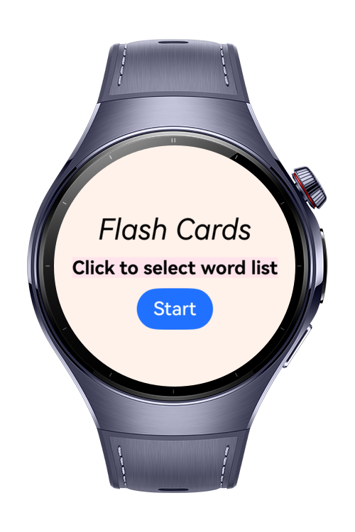
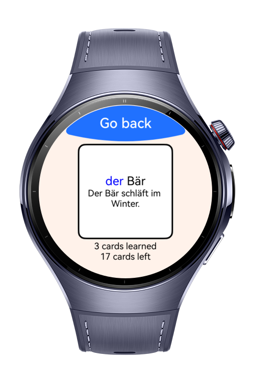

> **Note:** To access all shared projects, get information about environment setup, and view other guides, please visit [Explore-In-HMOS-Wearable Index](https://github.com/Explore-In-HMOS-Wearable/hmos-index).

# Flash Cards

**Flash Cards** is a HarmonyOS wearable sample application that help to learn foreign words. 
# Preview

<p align="left">
    
    
    
    
</p>


# Use Cases

* Learning and reviewing vocabulary on a daily basis
* Selecting and switching between different word lists

# Technology Stack
**Languages**: ArkTS, ArkUI  
**Frameworks**: HarmonyOS SDK 6.0.0  
**Tools**: DevEco Studio 6.0.0  
**Libraries/Kits**:
- @kit.ArkData
- @kit.BasicServicesKit
- @kit.ArkTS

# Directory Structure
```
/entry/src/main
├───ets
│   ├───common
│   │       DatabaseManager.ets
│   ├───components
│   │   ├───atoms
│   │   │       CustomText.ets
│   │   │       RectangularText.ets
│   │   │       RemainingBox.ets
│   │   ├───molecules
│   │   │       CardBack.ets
│   │   │       CardFront.ets
│   │   │       Word.ets
│   │   ├───organisms
│   │   │       FlashCard.ets
│   │   └───templates
│   │           Cards.ets
│   ├───models
│   │       WordData.ets
│   │       WordList.ets
│   │
│   └───pages
│           FlashCardsPage.ets
│           Index.ets
└───resources
    ├───base
    │   └───profile
    │           router_map.json
    └───rawfile
        └───wordLists
                A1DeutschTiere.json
                A1DeutschVerben.json
                A1DeutschWortliste.json
```


# Constraints and Restrictions

## Supported Device
- Huawei Watch 5

# License

**Flash Cards** is distributed under the terms of the **MIT License**.  
See the [LICENSE](LICENSE) file for more information.  